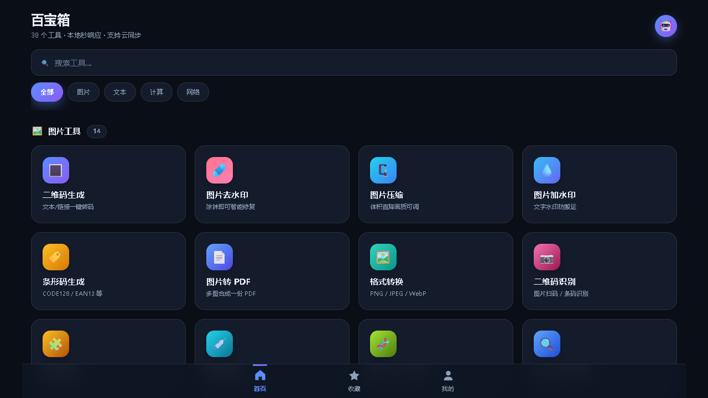
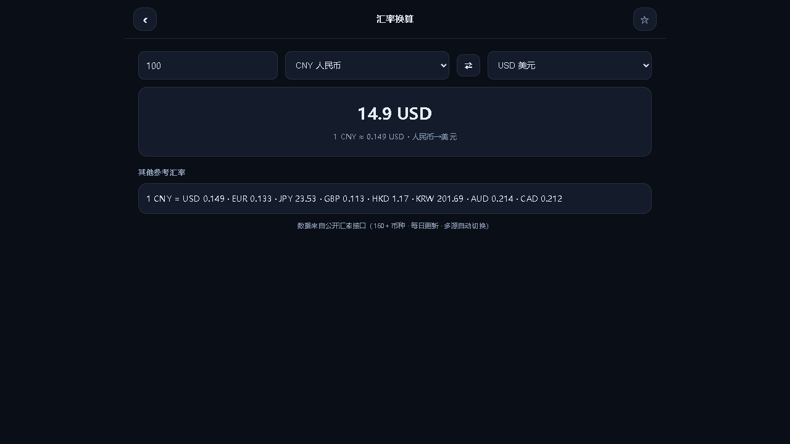

# 琉璃工具集

38 个随手能用的小工具，打开网页就行，不用装、不用注册。

**线上地址：<https://toolbox.liulichat.cn>**



---

## 用它的三种方式

**一、直接开网页**
访问 <https://toolbox.liulichat.cn>。点页脚那个 **「以本地模式体验」** 可以跳过登录直接用，收藏和主题存在本地。

**二、装成 App（推荐）**
- 手机 Chrome：菜单 →「添加到主屏幕」
- 手机 Safari：分享 →「添加到主屏幕」
- 桌面 Chrome / Edge：点地址栏右侧的「安装」图标

装完就是独立窗口、无地址栏、离线也能开（纯前端工具全部可用）。

**三、Android APK**
[下载页](https://toolbox.liulichat.cn/download/) 有直接可装的包。它是个 WebView 壳，界面和网页一致，多给了一个原生下载桥：网页里生成的图片、ZIP 能直接存进系统「下载」目录。

---

## 工具清单（38 个）

| 分类 | 工具 |
|---|---|
| **图片** 14 | 二维码生成 · 图片去水印 · 图片压缩 · 图片加水印 · 条形码生成 · 图片转 PDF · 格式转换 · 二维码识别 · 图片拼接 · 图片取色 · 图片 ↔ Base64 · OCR 文字识别 · 文字卡片 · 九宫格切图 |
| **文本** 8 | JSON 格式化 · Base64 编解码 · URL 编解码 · 文本转换 · JSON ↔ CSV · Markdown 预览 · 摩斯电码 · 文件打包 ZIP |
| **计算** 10 | 随机密码 · 时间戳转换 · 单位换算 · 颜色工具 · 进制转换 · UUID 生成 · 哈希计算 (MD5/SHA) · 随机决定 · 倒计时 · 屏幕检测 |
| **网络** 6 | 天气查询 · 汇率换算 · IP 查询 · 翻译 · 视频下载 · 视频转音频 |

---

## 两条取值方向

**一、能不上传就不上传。**
上面 38 个里，**35 个全程在你自己的设备上跑**——图片压缩、去水印、加水印、转 PDF、拼接、取色、九宫格、屏幕检测，这些全程在本地 canvas 处理，文件一次都不出你的设备，断网也能用。

只有三类必须走服务器，因为浏览器做不到：

| 工具 | 为什么必须上服务器 |
|---|---|
| OCR 文字识别 | 需要 tesseract 引擎 |
| 视频下载 | 要绕跨域、拿无水印直链 |
| 视频转音频 | 需要 ffmpeg 转码 |

**二、不引 CDN。**
八个第三方库（GSAP / pdf-lib / JSZip / marked / zxing / jsbarcode / md5 / qr-styling）全部放在 `libs/` 里本地化。不依赖任何外部 CDN，**断网也能完整打开**，也不会因为某个 CDN 挂掉而白屏。

联网工具调的外部接口只有四个：天气（Open-Meteo）、IP 归属地（ipwho.is）、翻译（MyMemory）、汇率。汇率做了**三个源自动降级**，某一个连不上会自己换下一个。

---

## 截图



还自带一个使用统计面板（`/admin.html`）：总次数、独立访客、今日数据、登录占比、平均停留、工具排行、访问趋势，明细可按工具 / 行为 / 关键词筛。它跟着仓库一起开源。

> 面板截图没放进来——那上面是我自己站点的真实访问数据，不适合公开。你在本地跑起来填几条数据，一屏就是同样的效果。

---

## 技术栈

**前端**：纯静态，无构建、无框架、无 npm。`index.html` + 原生 JS + 一份 CSS 设计系统（7 套主题）。第三方库本地化在 `libs/`。

**后端**：Python 3 标准库，零依赖（`http.server` + `sqlite3`）。同一个进程既提供 API 又托管前端静态文件。

**Android 壳**：不走 Gradle，直接用 `aapt2 → javac → d8 → zipalign → apksigner`，一条 `android/build.sh` 打完；推 main 分支由 GitHub Actions 云构建出 APK。

**部署结构**、**登录链路**、**仓库结构**、**工具分类**、**埋点数据流**——五张图见 [结构图.md](结构图.md)。

---

## 自己部署

前端是纯静态的，丢进任何 Web 服务器就能跑。要用联网功能才需要后端：

```bash
# 依赖（只有联网功能需要）
apt install python3 ffmpeg tesseract-ocr tesseract-ocr-chi-sim

# 起后端（默认 8792）
cd server && DEV=0 PORT=8792 HOST=127.0.0.1 ADMIN_KEY=你的口令 python3 api.py
```

nginx 反代一层即可。

把 `index.html` / `disclaimer/index.html` / `app-version.json` / `android/.../MainActivity.java` 里的 `hello@example.com` 换成你自己的邮箱，再把备案号换成你自己的（没有就整段删掉）。
注意 `ADMIN_KEY` 不配的话管理接口一律拒绝（这是故意的兜底，不会出现"没配密码等于没密码"）。

---

## 许可

[MIT](LICENSE)。第三方库的许可清单见 `libs/`（均为 MIT / Apache-2.0）。

---

<sub>线上演示：<https://toolbox.liulichat.cn> · 湘ICP备2026041818号-1</sub>
