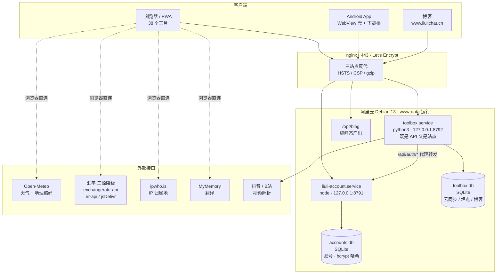
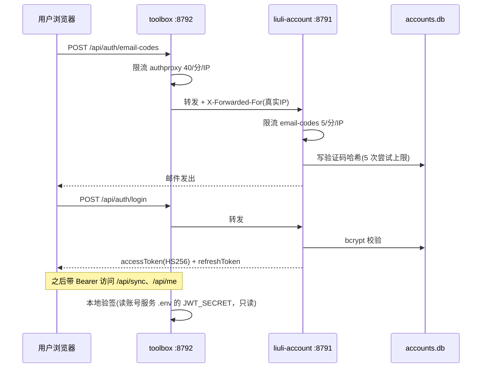
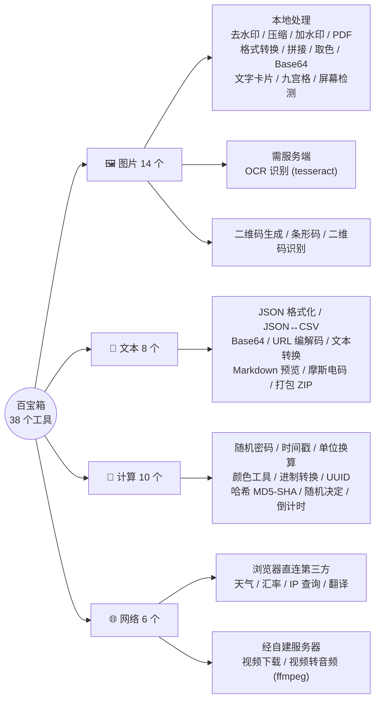
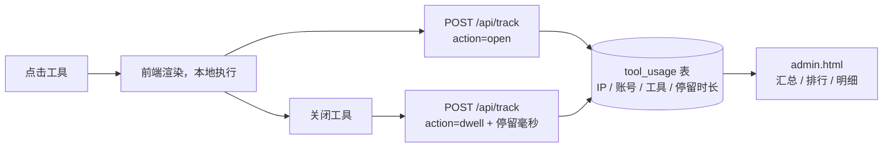

# 百宝箱 · 结构图（开源素材）

> 全部按 2026-10-06 实测状态绘制，没有推测。Mermaid 语法，GitHub 原生渲染。

---

## 图 1 · 部署架构



**几个容易看漏的点：**

- 前端调第三方接口是**浏览器直连**，不经过服务器 → 所以 nginx 的 `connect-src` 一旦收窄，工具就整片失效（2026-10-02 那次事故就是这个）
- `toolbox.service` 一个进程干两件事：对外是 API，同时托管整个前端静态目录
- 博客和工具箱**共用同一个后端进程**（博客的 `/api/` 也反代到 8792）
- 登录走的是独立账号服务，工具箱只做代理转发

---

## 图 2 · 登录链路



---

## 图 3 · 仓库结构

```
liuli-toolbox/                     48 个文件（远端 main）
├── index.html                     SPA 入口，按 ?v=N 破缓存
├── admin.html                     访问记录后台（X-Admin-Key 鉴权）
├── app-version.json               App 版本与更新说明
├── manifest.webmanifest           PWA 清单
├── css/app.css                    设计系统（7 主题 + 分区样式）
├── js/
│   ├── app.js                     核心：登录 / 主题 / 导航 / 收藏 / 云同步
│   ├── api.js                     接口客户端封装
│   ├── tools.js   ~ tools6.js     38 个工具的渲染与逻辑
│   └── (tools5.js 视频下载 / tools6.js 视频转音频)
├── libs/                          第三方库全部本地化，不走 CDN
│   ├── gsap.min.js  ScrollTrigger? 动效
│   ├── pdf-lib / jszip / marked / zxing / jsbarcode / md5 / qr-styling
├── icons/                         PWA 图标 180 / 192 / 512
├── download/
│   ├── index.html                 App 下载页
│   └── toolbox.apk                已签名 APK
├── disclaimer/index.html          免责声明
├── android/                       WebView 壳工程（不走 Gradle）
│   ├── build.sh                   aapt2 → javac → d8 → zipalign → apksigner
│   ├── src/…/MainActivity.java    壳 + 下载桥
│   ├── res/                       图标与主题
│   └── tools/gen_assets.py        图标生成
├── .github/workflows/build-apk.yml  推送即云构建 APK
├── docs/motion.md                 动效规范
└── README.md
```

> 后端 `server/`（api.py / setup.sh / test.sh）**不在仓库里**，只存在于服务器 `/opt/toolbox/server/`。

---

## 图 4 · 38 个工具的分类结构



**规律**：能纯前端做的全部纯前端（工具本地运行、秒级响应、不上传）；需要算力或绕跨域的三类——OCR、视频解析、视频转音频——才走自建服务器。

---

## 图 5 · 一次工具访问的数据流（含埋点）



埋点是**匿名可用**的：未登录记 `anon`，登录记账号标识。后台按真实客户端 IP 限 30 次/分钟。
